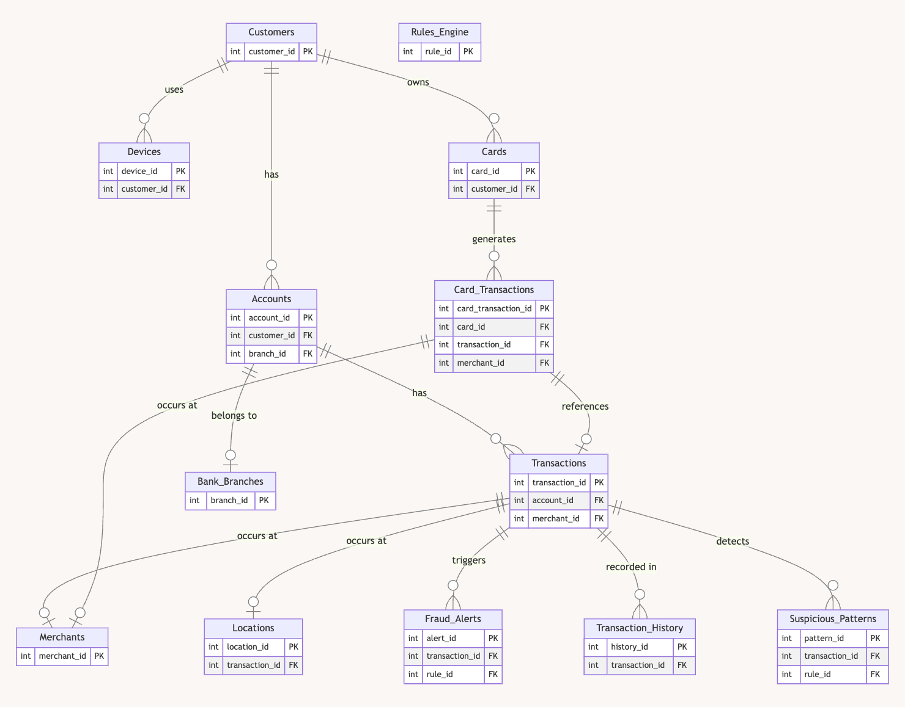
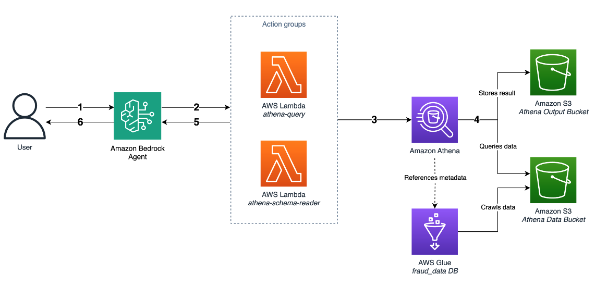
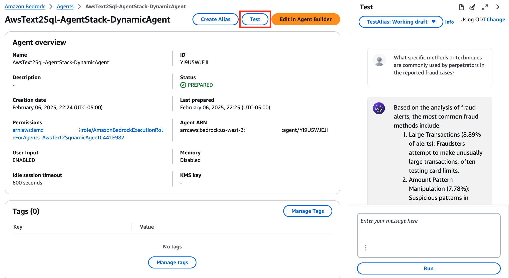
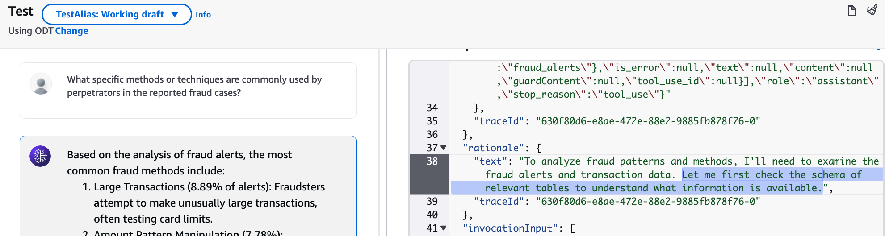
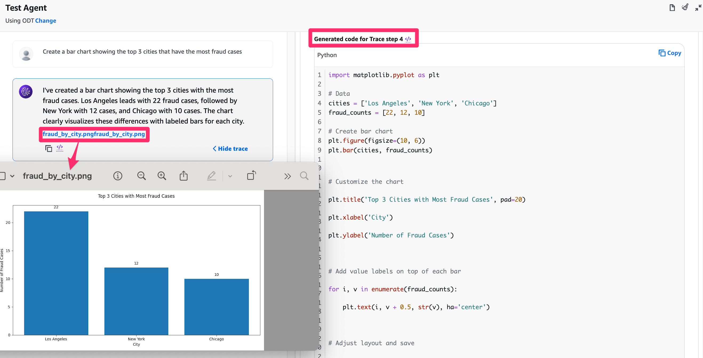

# Dynamic Text-to-SQL for Enterprise Workloads with Amazon Bedrock Agent

Elevate your data analysis with an end-to-end agentic Text-to-SQL solution, built on AWS for enterprise-scale adaptability and resilience. Ideal for complex scenarios like fraud detection in financial services.

🚀 Key Differentiators:

1. **Fully Agentic Process**: Leveraging Amazon Bedrock, the AI agent manages the entire workflow from question to insight.
2. **Dynamic Schema Discovery**: Adapts to evolving database structures in Amazon Athena in real-time.
3. **Intelligent Error Handling**: Autonomous troubleshooting and query refinement using AWS Lambda.

This solution goes beyond basic Text-to-SQL, offering a robust, self-adapting system for complex enterprise environments.

## Sample Database Overview

This example demonstrates a fraud detection database schema commonly used in financial institutions. The schema represents core tables needed for transaction monitoring and fraud investigation.

### Use Case: Fraud Investigation

Business analysts can query complex transaction patterns by asking questions in natural language, such as:

- "Show fraudulent transactions in the U.S. with device details"
- "List all transactions by John Doe in 2023 with fraud flags and merchant info"

Without Text2SQL capabilities, these queries would require:

- Knowledge of multiple table relationships
- Complex JOIN operations
- Understanding of specific column names and data types

### Schema Structure

The following ERD shows the key tables used in fraud detection:


> **Note:** This is a simplified version of a typical fraud detection database. Production environments often contain dozens or hundreds of interconnected tables.

### Using the Agentic Text2SQL System

The system provides a natural language interface to your database through Amazon Bedrock Agent. Here's how it works:

1. **Schema Discovery**
    - Lists available tables in the database
    - Provides detailed schema information including column names, data types, and descriptions
    - Helps users understand data structure without SQL knowledge

2. **Natural Language Query Processing**
    - Converts natural language questions into SQL queries
    - Executes queries against Amazon Athena
    - Returns results in user-friendly format

3. **Intelligent Error Handling**
    - Analyzes Athena error messages
    - Identifies root causes (syntax errors, missing tables, datatype mismatches)
    - Suggests and implements query modifications
    - Automatically retries corrected queries

**Note:** Detailed agent instructions can be found in [the sample agent prompt](prompt/instruction.txt).

**Important:** This system is designed for Amazon Athena which uses AWS Glue Data Catalog for metadata storage. When adapting to other databases:

- Schema retrieval syntax will differ (e.g., PostgreSQL, MySQL have different commands for accessing column comments)
- Column comments are crucial for the Text2SQL agent's accuracy
- Ensure proper access to metadata in your target database

### Agentic Text2SQL Flow



1. User asks questions to the Amazon Bedrock Agent.
2. To serve the user's questions, Agent determines the appropriate action to invoke:
    1. to execute the generated query with confidence, Agent will invoke athena-query tool
    2. to confirm the database schema first, it will invoke athena-schema-reader tool
        1. to understand what tables it has access to: /list_tables,
        2. to find out specific schema of a certain table: /describe_table
3. The Lambda function sends the query to Athena to execute
4. Athena queries the data from the S3 data bucket, and stores the query results in the S3 output bucket.
5. The Lambda function retrieves and processes the results. If an error occurs:
    - The Lambda function captures and formats the error message for Agent to understand
    - The error message is returned to the Amazon Bedrock Agent.
  The agent analyzes the error message and tries to resolve. To retry with the modified query, Agent may repeat 2-5.
6. The agent formats and presents the final responses to the user.

## Getting Started

### Prerequisites

- Node.js (>=v20)
- AWS CLI configured with appropriate credentials
- AWS CDK CLI installed (`npm install -g aws-cdk`) (>= 2.1000.2)
- Docker (Alternative: Rancher Desktop)
- Enable the model access to use Claude Sonnet 3.5 from AWS console

## AWS Generative AI CDK Constructs

This project utilizes [AWS Generative AI CDK Constructs](https://github.com/awslabs/generative-ai-cdk-constructs), a collection of AWS CDK constructs for building generative AI applications. These constructs provide high-level components that make it easier to integrate AWS AI/ML services into your infrastructure.

### Regional Configuration

The project is configured to use Amazon Bedrock in the US region by default. If you need to deploy in a different region, modify the `geoRegion` parameter in the cross-region inference profile configuration:

```typescript
const anthropicClaudeRegionInferenceProfile = bedrock.CrossRegionInferenceProfile.fromConfig({
  // Change this to your desired region:
  // US (default) - bedrock.CrossRegionInferenceProfileRegion.US
  // EU - bedrock.CrossRegionInferenceProfileRegion.EU,
  // APAC - bedrock.CrossRegionInferenceProfileRegion.APAC
  geoRegion: bedrock.CrossRegionInferenceProfileRegion.US,
  model: bedrock.BedrockFoundationModel.ANTHROPIC_CLAUDE_3_5_SONNET_V2_0
})
```

Note: Ensure that Amazon Bedrock and the selected model are available in your chosen region.

### Repository Structure

```filetree
.
├── bin/
│   └── Entry point for the CDK application
├── lib/
│   ├── agent-stack.ts
│   │   └── Defines the Bedrock Agent and related Lambda functions
│   ├── db-stack.ts
│   │   └── Sets up the Athena database and related S3 buckets
│   └── assets/
│       └── Sample data CSV files and JSON schema definitions
├── src/
│   ├── athena_query/
│   │   └── Lambda function for executing Athena queries
│   ├── athena_schema_reader/
│   │   └── Lambda function for reading Athena schema information
│   └── common/
│       └── Shared utilities and helper functions
└── prompt/
    └── Agent instruction for Text2SQL
```

### CDK Deployment

The project is deployed using AWS CDK. The `bin/agentic-text2sql.ts` file is the entry point for the CDK application. It creates two main stacks:

1. AthenaStack: Sets up the Athena database, S3 buckets, and Glue tables.
2. AgentStack: Creates the Bedrock Agent, Lambda functions, and associated resources.

### Deployment

1. Clone the repository:

   ```bash
   git clone https://github.com/aws-samples/sample-Dynamic-Text-to-SQL-with-Amazon-Bedrock-Agent.git
   cd sample-Dynamic-Text-to-SQL-with-Amazon-Bedrock-Agent
   ```

2. Install dependencies:

   ```bash
   npm install
   ```

3. Bootstrap your AWS environment (if not already done):

   ```bash
   cdk bootstrap aws://ACCOUNT-NUMBER/REGION
   ```

4. Deploy the stacks:

   ```bash
   cdk deploy --all
   ```

## How to Test

1. To examine the sample data, go to Athena and run queries, for example:
  
    ```sql
    SELECT * FROM fraud_data.accounts;
    ```

2. If you run the DESCRIBE clause, you can see detailed descriptions for each column. Without these descriptions, the Agent will attempt to interpret your database schema independently, and in most cases, it will understand generic terms like transaction_id. However, keep in mind that column comments are used to help the LLM better understand the data. Try to provide descriptions that are as detailed as possible.

    ```sql
    DESCRIBE fraud_data.transaction_history
    ```

3. Go to [Amazon Bedrock](https://console.aws.amazon.com/bedrock) and select **Agents.**

4. Select **AwsText2Sql-AgentStack-DynamicAgent** and test by asking questions in **Test** window on your right. 

    Example interactions:

   - What specific methods or techniques are commonly used by perpetrators in the reported fraud cases?
   - What patterns or trends can we identify in the timing and location of fraud incidents?
   - Show the details of customers who have made transactions with merchants located in Denver
   - Provide a list of all merchants along with the total number of transactions they have processed and the number of those transactions that were flagged as fraudulent
   - List the top 5 customers based on the highest transaction amounts they have made

  

1. Click Show trace and examine each step to understand what tools are used and the agent's rationale for approaching your question.

  

### Code Interpreter

In the context of TEXT2SQL, [Code Interpreter](https://docs.aws.amazon.com/bedrock/latest/userguide/agents-code-interpretation.html) can be particularly useful for:

- Creating data visualizations from SQL query results
- Performing additional data analysis beyond simple SQL queries 

Example interactions:

- "Create a bar chart showing the top 3 cities that have the most fraud cases"

- 

## Troubleshooting

- If you encounter unexpected responses in the test window, clear the session history:
  - Click the broom icon (🧹) in the top right corner of the test window
  - Start a new conversation
- Check agent's rationale to understand agent's approach
- If queries consistently fail, check the CloudWatch logs for the relevant Lambda functions (Athena Query and Athena Schema Reader).
- Enable [Bedrock model invocation logging](https://docs.aws.amazon.com/bedrock/latest/userguide/model-invocation-logging.html) to troubleshoot

## Customization Considerations

When adapting this solution to your environment:

- **Agent Instructions**: Update the agent instructions in `prompt/instruction.txt` to reflect your specific database environment and schema discovery methods.

- **Database Metadata Sources**: This sample uses AWS Glue Data Catalog via Athena's `SHOW tables` and `DESCRIBE table` commands. If your metadata is stored elsewhere (PostgreSQL's information_schema, Oracle's data dictionary, etc.), you'll need to modify the schema discovery approach accordingly.

- **Metadata Enrichment**: If your database doesn't provide sufficient context through column comments, consider implementing a supplementary metadata repository to provide the agent with richer information about your data model, business context, and table relationships.

- **Tool Interaction Optimization**: Our sample implementation processes one table at a time, which is simple but may require multiple turns for complex queries. In production environments, consider implementing bulk metadata retrieval or caching strategies to reduce latency and provide more complete context to the agent.

## License

- [MIT-0](/LICENSE)

## Clean Up

If you've decided to remove the resources, follow these steps carefully:

1. Destroy the stacks:

   ```bash
   cdk destroy --all --force
   ```

   This command will destroy the CDK application without asking for confirmation.

2. Verify deletion in [CloudFormation](https://console.aws.amazon.com/cloudformation)

3. Manually force delete any remaining resources if necessary.

4. Delete CloudWatch Log Groups or set retention period in CloudWatch console.
